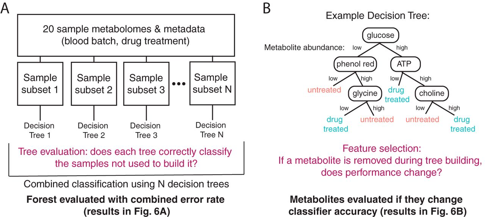

```{r setup}
knitr::opts_chunk$set(echo = TRUE)

path = "/Users/mac9jc/Documents/work/TUMI/microbiome_course_2021"

knitr::opts_knit$set(root.dir = path)

```

# Summary of experiment (from the scientists)^[Data were provided by Nishikant Wase and preprocessed on the previous day of this workshop. Data are unpublished.]

Maize seeds were inoculated with either water or *Pseudomonas fluorescens* in three separate experiments and allowed to germinate.  Seeds treated with the bacteria showed a difference in both root and shoot growth. The root tissues were extracted by grinding with liquid nitrogen and stored for future use in untargeted metabolomics experiment.  

Our main aim for this experiment was to understand metabolomic changes in roots treated either with water or with suspension of *P. fluorescens*.

In this experiment, we ran 5 replicates of the mock treatment and 4 replicates of *P. fluorescens*-treated roots (here on referred to as 'Pf'). A pooled quality control sample was created after the extraction by aliquoting 10 uL of metabolite extract from each sample for identification and quality control. Blank samples are 0.1% formic acid in water. 

# Prep computational environment

```{r,warning=TRUE, message=FALSE}

library(tidyverse)
library(randomForest)
library(pROC)
library(readxl)
library(ggpubr)
library(vegan)
library(mixOmics)

# experiment metadata
metadata = read_excel(paste(path,"/metabolomics/processed_metabolomics_data.xlsx",sep = ''), sheet = "sampleMetadata")
# untargeted mass spec results (Note: Nishikant Wase's previous day of workshops generated this file from the raw spectra)
df = read_excel(paste(path,"/metabolomics/processed_metabolomics_data.xlsx",sep = ''), sheet = "FilteredDataMatrix")

```

# Start data preprocessing

Look at metabolomics data for each sample group.

```{r}

# looks at column names in data
colnames(df)
# separate metabolite information from metabolite abundances
met_abund = df[,colnames(df) %in% c("Alignment ID",
                                    "x01222021x_blank1","x01222021x_blank2",
                                    "x01222021x_Met_Mock_R1","x01222021x_Met_Mock_R2",
                                    "x01222021x_Met_Mock_R3","x01222021x_Met_Mock_R4",
                                    "x01222021x_Met_Mock_R5",
                                    "x01222021x_Met_PF_R2","x01222021x_Met_PF_R3",
                                    "x01222021x_Met_PF_R4","x01222021x_Met_PF_R6",
                                    "x01222021x_Met_pooled_QC1","x01222021x_Met_pooled_QC2",
                                    "x01222021x_Met_pooled_QC3","x01222021x_Met_pooled_QC4")]
met_info = df[,!(colnames(df) %in% c("x01222021x_blank1","x01222021x_blank2",
                                     "x01222021x_Met_Mock_R1","x01222021x_Met_Mock_R2",
                                     "x01222021x_Met_Mock_R3","x01222021x_Met_Mock_R4",
                                     "x01222021x_Met_Mock_R5",
                                     "x01222021x_Met_PF_R2","x01222021x_Met_PF_R3",
                                     "x01222021x_Met_PF_R4","x01222021x_Met_PF_R6",
                                     "x01222021x_Met_pooled_QC1","x01222021x_Met_pooled_QC2",
                                     "x01222021x_Met_pooled_QC3","x01222021x_Met_pooled_QC4"))]
# identify sample groups
grps = c("blank","blank",
         "Mock","Mock","Mock","Mock","Mock",
         "Pf","Pf","Pf","Pf",
         "pooledQC","pooledQC","pooledQC","pooledQC")
names(grps) = c("x01222021x_blank1","x01222021x_blank2",
                "x01222021x_Met_Mock_R1","x01222021x_Met_Mock_R2",
                "x01222021x_Met_Mock_R3","x01222021x_Met_Mock_R4",
                "x01222021x_Met_Mock_R5",
                "x01222021x_Met_PF_R2","x01222021x_Met_PF_R3",
                "x01222021x_Met_PF_R4","x01222021x_Met_PF_R6",
                "x01222021x_Met_pooled_QC1","x01222021x_Met_pooled_QC2",
                "x01222021x_Met_pooled_QC3","x01222021x_Met_pooled_QC4")

```

Double check missing values have been removed/imputed.

```{r}

min(met_abund[,-1])>0

```

What would happen if there were 'NA's indicating missing values in the dataset? Try testing this:

```{r, eval = FALSE }

min(c(1,2,NA))

```

Ok, so missing values have been eliminated by removing metabolites that were frequently below the limit of detection and/or imputation. 

------

On to our analyses!

# Plot the data

I always like to take a look at the data before I get started. This will clue you in to any potential challenges that may arise or any issues you need to correct, such as:

1. Do you have sufficient N to detect a difference in sample groups? 
2. Is there an outlier that you want to follow up on?
3. Are the data formatted as you expected?
4. Are the data normalized as you expected?

## Basic plotting

For example, let's say you knew Alignment ID 969 was interesting based on previous experiments. What metabolite does Alignment ID 969 represent?

```{r}

interesting_met = met_info[met_info$`Alignment ID` == 969,] %>% pull(`Metabolite name`)

interesting_met

```

Now let's see the relative abundance of `r interesting_met` in each group.

```{r}

# extract metabolite 969 from dataset
interesting_met_abund = met_abund[met_abund$`Alignment ID` == 969,]
# remove column with Alignment ID, since we only have one left in our dataset
interesting_met_abund$`Alignment ID` = NULL
# merge metabolite abundance with group names
interesting_met_abund_w_grps = rbind(interesting_met_abund, grps)
# flip dataframe for easier plotting
df_to_plot = as.data.frame(t(interesting_met_abund_w_grps))
# add column headers for easier data access
colnames(df_to_plot) = c('metabolite_abundance', 'group')
# make sure the abundances are read as numbers not as text
df_to_plot$metabolite_abundance = as.numeric(df_to_plot$metabolite_abundance)

# plot
ggplot(data = df_to_plot, aes(x = group, y = metabolite_abundance, color = group)) + # set variables
  geom_boxplot() + # make it a boxplot
  geom_point(size = 4) + # add points
  guides(color = F) # hide legend
  
```

By eye, it looks like there may not be a difference in `r interesting_met` between the infected (Pf) group and the mock-treated group, especially since this metabolite can be detected at similar levels in the blank sample. However, performing a statistical test would give us higher confidence in this conclusion. Here's one way we can do this:

```{r}

group_options = unique(df_to_plot$group)
my_comparisons <- list(c(group_options[1], group_options[2]), 
                       c(group_options[1], group_options[3]), 
                       c(group_options[1], group_options[4]),
                       c(group_options[2], group_options[3]),
                       c(group_options[2], group_options[4]),
                       c(group_options[3], group_options[4]))

# remake previous figure
p = ggplot(data = df_to_plot, aes(x = group, y = metabolite_abundance, color = group)) + 
  geom_boxplot() + 
  geom_point(size = 4) +
  guides(color = F)
# add statistics 
p + stat_compare_means(comparisons = my_comparisons, size = 3, method = 't.test')

```

A t-test confirms that there is no meaningful difference in `r interesting_met` in this study. FYI, the function we just used to perform a t.test ('stat_compare_means') does not do multiple testing corrections. We will discuss that later!

------

As an aside, I want to talk a bit about plotting in R. The biggest strength of making figures programmatically (as opposed to Excel or Prism, or other approaches that don't use code) is that your figures are 100% reproducible and customizable and all errors are traceable. Making figures in Excel or Prism may be easier to start, but there is no documentation (i.e. code) of what you did. 

`ggplot2`, the package used here, is just one way to do it and my personal favorite. Strengths of `ggplot2` specifically are that its relatively easy to make publication quality figures and many application-focused packages provide even-easier-to-use wrappers for ggplot plotting (think: PCA from Tuesday's workshop with `phyloseq`). My favorite feature of `ggplot2` is how you can layer on new information or plotting approaches. For example, in the plot above, we first specified what data would be used and the x- and y-axes here:

```{r}

p = ggplot(data = df_to_plot, aes(x = group, y = metabolite_abundance, color = group))
p

```

Next, we told the program what type of plot to make (boxplot) so it plotted the data (specified in the first step) using this approach:

```{r}

p = p + geom_boxplot() 
p

```

Third, we layered on points:

```{r}

p = p + geom_point(size = 4) 
p

```

Fourth, we hide the legend:

```{r}

p = p + guides(color = F)
p

```

Fifth, we added statistics:

```{r}

p = p + stat_compare_means(comparisons = my_comparisons, size = 3, method = 't.test')
p

```

We could go even further, e.g. changing the color scheme, background, changing the axis labels, and adding a title:

```{r}

p = p + 
  scale_color_manual(values = c("grey","blue","pink","green")) +
  theme_bw() +
  xlab(NULL) +
  ylab("abundance") +
  ggtitle(paste(interesting_met, "abundance with t.test", sep = " "))
  
p

```

------

Next, let's look at all of the metabolites at once. For example, we'd expect to see a similar range of metabolite abundances in all sample groups. A histogram would be useful for this purpose.

```{r}

# remove Alignment ID column
met_abund_temp = met_abund
met_abund_temp$`Alignment ID` = NULL
# merge metabolite abundance with group names
met_abund_w_grps = rbind(grps,met_abund_temp)
# flip dataframe for easier plotting
df_to_plot = as.data.frame(t(met_abund_w_grps))
# add column headers for easier data access
colnames(df_to_plot)[1] = 'group'
# reorganize data
df_to_plot = tidyr::pivot_longer(df_to_plot, !group, names_to = "metabolite", values_to = "abundance")
# make sure the abundances are read as numbers not as text
df_to_plot$abundance = as.numeric(df_to_plot$abundance)

ggplot(data = df_to_plot, aes(x = abundance, fill = group)) +
  geom_histogram(bins = 100) + scale_x_sqrt() +
  facet_wrap(~group) + guides(fill = F)

```

------

PS - Have questions about that 'pivot_longer' step? It's extremely useful but a little challenging to understand at first. Check this out:^[from https://fromthebottomoftheheap.net/2019/10/25/pivoting-tidily/]


------

## Principal component analysis

One of my favorite tools to use before digging into specific analysis is principal component analysis. High dimensional data are often defined as datasets that have more variables than observations (e.g. more metabolites than samples). It is challenging to use many simple statistical methods with these datasets, so dimensionality reduction is a useful tool. I recommend you read [this paper](https://www.nature.com/articles/nrm2041) and [this paper](https://journals.plos.org/ploscompbiol/article?id=10.1371/journal.pcbi.1006907#sec006) to better understand dimensionality reduction.

The key feature of PCA to understand is that new variables (components) are created to summarize your existing variables; the aim is to summarize all of the variation in your dataset with fewer components than input variables. Each component is a linear function of your variables. An example 2 component PCA for a 3 variable dataset (AKT, JNK, & MK2) is shown in this figure^[Sorry for the blurry image quality, image from [this paper](https://www.nature.com/articles/nrm2041)]:


Let's define a couple functions that will make our PCA plot easier. Long-winded explanations of each function will make more sense later!

```{r}

# this extracts the variance explained by the FIRST component from the PCA results
get_1st = function(input_pca) {
  # class(input_pca) = "prcomp"
  temp = summary(input_pca)
  temp2 = temp$importance
  return(round(temp2[2,1]*100, digits = 2))
}

# this extracts the variance explained by the SECOND component from the PCA results
get_2nd = function(input_pca) {
  # class(input_pca) = "prcomp"
  temp = summary(input_pca)
  temp2 = temp$importance
  return(round(temp2[2,2]*100, digits = 2))
}

# we will use the function prcomp in the preinstalled stats package for performing principal component analysis.
# PCR requires centered and scaled data to be able to compare variables on different scales/ranges
# i.e. some metabolites range from 0-1,000 others may range from 1,000,000-2,000,000
# however, that function (prcomp) can center and scale your data to the MEAN, but we want to center and scale to the MEDIAN 
# because using the median is less sensitive to outliers
median_center_scale_data <- function(x) {
  # x is matrix or dataframe with rows as samples and columns as mets
  sd_x = apply(x,2,sd,na.rm=TRUE)
  x_centered = apply(x, 2, function(y) (y - median(y,na.rm=TRUE)))
  x_centered_scaled = sweep(x_centered, 2, sd_x, "/")
  indx = setdiff((which(is.na(x_centered_scaled))),which(is.na(x_centered)))
  if (any(is.na(x_centered_scaled))) { 
    x_centered_scaled[indx] = 0}
  if (any(is.na(x_centered_scaled))) { warning('sd == 0')}
  return(x_centered_scaled)}

```

Before performing PCA, the data needs to be normalized. Specifically, we need to perform 'feature' normalization by logging values and then centering and scaling them on a feature-by-feature basis (a.k.a. metabolite-by-metabolite basis).

```{r}

# remove Alignment ID column
met_abund_temp = met_abund
met_abund_temp$`Alignment ID` = NULL

# Feature normalization (log, center, scale)
# log
log_data = log2(met_abund_temp)
# prep format for PCA
data_transposed = t(log_data)
# [median] center & [sd] scale
data_for_pca = median_center_scale_data(data_transposed) 

```

We can confirm these steps by again plotting histograms of the dataset.

```{r}

# merge metabolite abundance with group names
met_abund_w_grps = cbind(grps,as.data.frame(data_for_pca))
# reorganize data
df_to_plot = tidyr::pivot_longer(met_abund_w_grps, !grps, names_to = "metabolite", values_to = "abundance")

ggplot(data = df_to_plot, aes(x = abundance, fill = grps)) +
  geom_histogram(bins = 100) + 
  facet_wrap(~grps) + guides(fill = F) +
  xlab('scaled abundance')

```

With the centered and scaled data, we can perform PCA.

```{r}

pca_data = prcomp(data_for_pca, center = F, scale. = F) # Center and Scale = FALSE because we've done it already
summary(pca_data)
# get first two components
data_plot = data.frame(pca_data$x[,c(1,2)]) 

```

And plot it: 

```{r}

group = factor(metadata$group)
ggplot(data = data_plot, aes(x = PC1, y = PC2))+
  geom_point(aes(color = group), size=I(2), alpha = .9) +#, show.legend = FALSE) +
  theme(axis.text = element_text(family = "Helvetica")) + 
  ylab(paste("PC2 (",paste(get_2nd(pca_data),"%)", sep = ""),sep = "")) + 
  xlab(paste("PC1 (",paste(get_1st(pca_data),"%)", sep = ""),sep = "")) 


```

You may also want to perform a statistical test, a PerMANOVA, to see if the clusters separate.

A PerMANOVA, or permutational multivariate analysis of variance, is 

> used to compare groups of objects and test the null hypothesis that the centroids and dispersion of the groups as defined by measure space are equivalent for all groups^[from Wikipedia and my favorite definition]

Basically, a centroid is calculated for each group by finding a point that is as close to all of the points as possible (i.e. minimize the distance between all points and the centroid). If you were to then calculate the distance between every point on the plot, would the group members be closer to the centroid than the nongroup members? (Full disclosure, if the clusters don't look obviously different, I wouldn't over interpret a statistically significant difference in the PerMANOVA but I would hypothesize that non-linear approaches like random forest below would yield interesting results!)

```{r}

t = adonis(data_plot ~ group, data = metadata, method = "eu") # PerMANOVA
print(t)

```

Note: ever wonder what the difference between PCA and PCoA is? PCoA, or Principal coordinate analysis, is a 'fancy' PCA, principal component analysis. If you were to calculate the distance between all samples, basically tabulate the distance between all points in a PCA plot, and then perform PCA on those distance calculations, you would have performed a PCoA. This is particularly useful when you want to use more complex distance calculations (i.e. phylogenetic relatedness) or use multiple variable types (i.e. metabolomics data AND microbiome data).

# Removing our QC samples

We are not actually interested in the metabolites detected in the blank or pooled QC (quality control) samples. We need to remove these. However, as shown with `r interesting_met`, we don't want to consider the metabolites that were measured in the blank samples. 

Let's first find the mean of all metabolites detected in the blanks samples. Then we will subtract these abundances from all measured samples.

```{r}

# get only the values that are associated with blank samples
blanks = as.data.frame(met_abund[,colnames(met_abund) %in% c("Alignment ID","x01222021x_blank1","x01222021x_blank2")])
# make metabolite ID into the rownames, rather than a column
rownames(blanks) = blanks$`Alignment ID`
# remove metabolite ID column
blanks$`Alignment ID` = NULL
# get mean value for each metabolite
blanks = base::rowMeans(blanks)

```

Now, we can subtract the mean blank value from the abundance of each sample.

```{r}

# make metabolite ID into the rownames, rather than a column
met_abund_temp = as.data.frame(met_abund)
rownames(met_abund_temp) = met_abund_temp$`Alignment ID`
# remove metabolite ID column
met_abund_temp$`Alignment ID` = NULL
# drop the blank columns
met_abund_temp = met_abund_temp[,!(colnames(met_abund_temp) %in% c("x01222021x_blank1","x01222021x_blank2"))]
# add mean of blank values
met_abund_temp = cbind(met_abund_temp,blanks)
met_abund_normalized_to_blanks = met_abund_temp[1:ncol(met_abund_temp)-1]-met_abund_temp[,ncol(met_abund_temp)]
# drop pooled columns
met_abund_normalized_to_blanks = met_abund_normalized_to_blanks[,!(colnames(met_abund_normalized_to_blanks) %in% c("x01222021x_Met_pooled_QC1", "x01222021x_Met_pooled_QC2", "x01222021x_Met_pooled_QC3","x01222021x_Met_pooled_QC4"))]
# replace negative values with a very small number
# replacing with 0 will generate errors at the log2 step below
min_Val = min(met_abund_normalized_to_blanks[met_abund_normalized_to_blanks > 0])
met_abund_normalized_to_blanks[met_abund_normalized_to_blanks <= 0] = min_Val/10000

```

FYI this dataset (without the blanks and QC samples) will be used from here on out.

Let's redo the PCA in light of these changes.

```{r}

# remove Alignment ID column
met_abund_temp = met_abund_normalized_to_blanks
met_abund_temp$`Alignment ID` = NULL

# Feature normalization (log, center, scale)
# log
log_data = log2(met_abund_temp)
# prep format for PCA
data_transposed = t(log_data)
# [median] center & [sd] scale
data_for_pca = median_center_scale_data(data_transposed) 

# do PCA
pca_data = prcomp(data_for_pca, center = F, scale. = F)
summary(pca_data)
# get first two components
data_plot = data.frame(pca_data$x[,c(1,2)]) 

# plot
group = gsub('.{3}$', '', rownames(data_for_pca))
group = factor(gsub('x01222021x_Met_', '', group))
ggplot(data = data_plot, aes(x = PC1, y = PC2))+
  geom_point(aes(color = group), size=I(2), alpha = .9) +#, show.legend = FALSE) +
  theme(axis.text = element_text(family = "Helvetica")) + 
  ylab(paste("PC2 (",paste(get_2nd(pca_data),"%)", sep = ""),sep = "")) + 
  xlab(paste("PC1 (",paste(get_1st(pca_data),"%)", sep = ""),sep = "")) 

```

Principal component 2 (PC2) separates the two experimental groups - let's identify which metabolites contribute significantly to the variation explained in PC2. To do this, we will look at the component's loadings. Loadings are called `rotation` with the `prcomp` function and are more techinically known as the eigenvalues.

```{r}

loadings = pca_data$rotation
PC2_loadings = loadings[,2] # second column for PC2
most_important = tail(sort(PC2_loadings))
names(most_important)

```

Again, we're focused on Alignment ID, so let's convert these to metabolite names:

```{r}

met_info %>% filter(`Alignment ID` %in% names(most_important)) %>% pull(`Metabolite name`)

```

Let's save these to compare to other variable selection techniques later.

```{r}

save_for_comparison_later_PCA = met_info %>% filter(`Alignment ID` %in% names(most_important)) %>% pull(`Metabolite name`)

```

We can also look to see how well the model summarizes variation overall. (This is called a 'scree plot' - I have no idea why.^[Update: I googled it and apparently "scree" describes a rocky cliff per [Wikipedia](https://en.wikipedia.org/wiki/Scree_plot)])

```{r}

# Variability of each PC
var_comp = pca_data$sdev^2
# Variance explained by each PC
var_exp = var_comp / sum(var_comp)
PC = as.factor(c(1:length(var_exp))) # as.factor makes a variable discrete - see discussion below in 'Perform machine learning with Random Forest Classification' section
var_exp1 = data.frame(PC, var_exp)
ggplot(as.data.frame(var_exp1), aes(x = PC, y = var_exp)) + 
  geom_bar(stat = "identity") 

```


PC1 & PC2 describe much more variation than the later components, so a 2-dimensional PCA plot will likely capture most of the important differences in samples.

```{r}

var_exp2 = data.frame(PC, cumsum(var_exp))
colnames(var_exp2)[2] = 'sum of variation explained'
ggplot(as.data.frame(var_exp2), aes(x = PC, y = `sum of variation explained`)) + 
  geom_bar(stat = "identity") 


```

However, we should keep in mind that these two components summarize less than 50% of the total variation.

# More multivariate statistics

Multivariate statistics come in several flavors - unsupervised and supervised. Unsupervised analyses do not require the input of any grouping data, whereas supervised analyses aim to distinguish members of groups (e.g. plants infected with Pf from mock-infected plants). PCA, performed above, is an unsupervised analysis whereas random forest classification and partial least squares discriminant analysis are supervised techniques.

## Perform machine learning with Random Forest Classification

Random forest is an ensemble machine learning approach used to classify samples into particular groups (i.e. a classifier) or to predict a continuous variable (i.e. regressor). Continuous variables are those that cannot be counted such as age or concentration. (The opposite of a continuous variable is a discrete variable such as colors [blue or red]. All continuous variables can be turned into discrete variable, e.g. age in years or binned concentration [high v. low].) A random forest is built up of many decision trees, each of which are constructed from subsets of data and internally validated with respect to the remaining dataset. With this approach, variables can be ranked by their effect of the classifer accuracy.



If you have sufficient N, it is wise to split the dataset into training and test sets. Even though random forest is an internally validated (i.e. it performs a training and test split for every tree), splitting your data into a training and test dataset increases your confidence in the quality of the model and minimizes overfitting. This can only be performed if you have sufficient N and would look something like this:

```{r, eval = F}

# Set random seed (otherwise random splits will be irreproducibly random!)
set.seed(2021)
# transpose to have rows as samples and columns as mets
t_met_abund_normalized_to_blanks = t(met_abund_normalized_to_blanks)
# Generate a random sample with half of the dataset
indexes = sample(1:nrow(t_met_abund_normalized_to_blanks), size = floor(nrow(t_met_abund_normalized_to_blanks)/2))
# Split into training and test sets
training = t_met_abund_normalized_to_blanks[indexes,]
test = t_met_abund_normalized_to_blanks[-indexes,]

```

Since this project has only 9 samples, we cannot/should not do this. So we will use the full dataset.

First, we will build the random forest classifier.

```{r}

# Set random seed (otherwise random splits will be irreproducibly random!)
set.seed(2021)
# transpose to have rows as samples and columns as mets
data_for_rf = as.data.frame(t(met_abund_normalized_to_blanks))
# add group to dataset
group = gsub('.{3}$', '', rownames(data_for_rf))
group = factor(gsub('x01222021x_Met_', '', group))
data_for_rf$group = group
# modify how metabolite IDs are referenced because randomForest doesn't handle column names as numbers well
colnames(data_for_rf) = paste('met_',colnames(data_for_rf), sep = '')
colnames(data_for_rf)[colnames(data_for_rf) == 'met_group'] = 'group'
rf_classifier = randomForest(group ~ ., data=data_for_rf, ntree=100, mtry=2, importance=TRUE)

```

Look at summary of model performance

```{r}

rf_classifier

```

Ok, so the model is not great. We are seeing a high out-of-bag (OOB) error rate and the confusion matrix indicates that we did not accurately predict sample group.

Let's take a deeper look. How well does the model correctly label samples?

```{r}

predictions = as.data.frame(predict(rf_classifier,type="prob"))
predictions$predict = names(predictions)[1:2][apply(predictions[,1:2], 1, which.max)]
predictions$observed = data_for_rf$group

```

A ROC curve, or receiver operating characteristic curve, is a helpful tool to evaluate a random forest classifier and graphically shows the predictive ability of a classifier over a range of parameters. (This is only useful for binary classifiers.)

There is always a trade off between sensitivity and specificity, but at some thresholds, the model may perform particularly well. Just a reminder, sensitivity is the true positive rate:

$$
\frac{TruePositives}{TruePositives + FalseNegatives}
$$

Specificity is the true negative rate:

$$
\frac{TrueNegatives}{TrueNegatives + FalsePositives}
$$

Prep receiver operator characteristic (ROC) curve.

```{r}

ROC_val = roc(ifelse(predictions$observed=='PF', 'PF', 'Mock'), as.numeric(predictions$PF))
  
```

We quantify this ROC by calculating the area-under-the-curve, or AUC. An AUC of 0.5 means the model performed about as well as chance and anything higher than 0.5 means the model is better than chance and knowledge can be gained from this analysis.

```{r}

AUC_val = auc(ROC_val)
AUC_val
  
```

Let's plot the ROC curve with a grey dotted line indicating that `AUC=0.5` performance we'd like to beat.

```{r}

ggroc(list(ROC_val), aes = "colour") +
  theme_bw() +
  geom_segment(aes(x = 1, xend = 0, y = 0, yend = 1), color="grey", linetype="dashed") +
  scale_color_manual(values = c("blue","red"), guide = F) +
  theme(plot.margin=unit(c(.5,.5,.5,.5),"cm"),
        legend.title = element_blank()) +
  annotate("text", label = paste0("AUC = ",round(AUC_val, digits = 2)), x = .25, y = .27, color = "blue") 

```

This model does not perform well, so we should not over interpret the results of this classifier. However, I want to walk you through some interpretive analyses. *If* the model was predictive, we might be interested in identifying which variables are important. 

*MeanDecreaseAccuracy* (or the mean decrease in accuracy) is a metric of variable important and tells you the effect of removing a variable on model performance. *MeanDecreaseGini* (the mean decrease in Gini index) is another (more complex) metric of variable importance and quantifies the measure of 'node impurity.' This evaluates how well a variable splits your classification groups.

```{r}

varImpPlot(rf_classifier)

```

Cool, but what are the names of these metabolites? We will have to do some data wrangling to make this more interpretable.

```{r}

# these are the metabolite names for the Alignment IDs - keep this
met_names = met_info[,c("Alignment ID", "Metabolite name")]
# but remember we added 'met_' to the beginning of each alignment ID for the random forest? well, we did, so let's do that here
met_names$`Alignment ID` = paste('met_',met_names$`Alignment ID`,sep = '')

# let's extract the node impurity score from our classifier
extracted_importance = importance(rf_classifier,type=2) # type 2 = node impurity
# sort node impurity scores
extracted_importance = extracted_importance[rownames(extracted_importance)[order(extracted_importance)],]
# extract most important variables
top10 = tail(extracted_importance,10)
# reorganize these important variables into dataframe
top10 = as.data.frame(top10) %>% rownames_to_column('variable') %>% dplyr::rename(value = top10)
# get the full names of only the top 10 most important variables
met_names = met_names[met_names$`Alignment ID` %in% top10$variable,]
# merge variable importance with met name
plot_df = merge(met_names,top10, by.x= 'Alignment ID', by.y = "variable", all.x = F, all.y = T)

```

Ok now we can plot it.

```{r}

ggplot(data = plot_df) +
  geom_bar(aes(x=reorder(`Metabolite name`,value), y = value), 
           stat = "identity", width=0.4) +
  xlab(NULL) + 
  ylab('Mean decrease in node impurity') + 
  coord_flip()

```

FYI if you just made a plot with ggplot, you can save it like this as a pdf/png/whatever you want:

```{r, eval = F}

ggsave("/path/to/folder.png",width = 7,height = 3,units = "in",dpi = 300)

```

Before moving on to our next multivariate/machine learning approach, let's compare the most important variables identified by random forest to those identified by the PCA. Which are in both lists?

```{r}

save_for_comparison_later_RF = plot_df$`Metabolite name`
save_for_comparison_later_RF[save_for_comparison_later_RF %in% save_for_comparison_later_PCA]

```

None? Why might this be?

## Partial least squares discriminant analysis 

Partial least squares discriminant analysis, or PLS-DA, is another supervised multivariate approach. PLS-DA can be thought of as a supervised version of PCA - both reduce the dimensions of large datasets using linear approaches. Like random forest however, PLS-DA considers class labels and can be used for feature selections (that is, identifying most important variables).

For the sake of time, we won't get into the math behind PLS-DA here. However, [this paper](https://www.nature.com/articles/nrm2041) is also a great resource if you are interested!

With random forest, it is strongly suggested to do a training and a test split of your data. However, for PLS-DA, it is essential to build your model on a subset of your data (a training set) and test it with a distinct subset of data (a test set). This is because PLS-DA is not internally validated like random forest - all of the provided data is used to build the model. Otherwise, it is easy to accidentally overinterpret an 'overfit' model, or start to interpret the biology of a highly accurate model that cannot be extrapolated to any new datasets. For this example, there is not sufficient N to do this so this is merely an example of the code used to run PLS-DA.

Let's get started.

```{r}

# transpose to have rows as samples and columns as mets
data_for_plsda = as.data.frame(t(met_abund_normalized_to_blanks))
data_for_plsda_wo_grp = data_for_plsda
# add group to dataset
group = gsub('.{3}$', '', rownames(data_for_plsda))
group = factor(gsub('x01222021x_Met_', '', group))
data_for_plsda$group = group


## PLS-DA function
plsda.res = plsda(data_for_plsda_wo_grp, 
                  data_for_plsda$group, 
                  ncomp = 2, scale = TRUE, logratio="CLR") 
```

Now let's plot the results:

```{r}

plotIndiv(plsda.res, legend = T, ellipse = T, title = 'PLS-DA for Pf-treated maize')

```

Like with PCA, we are interested in seeing if the sample groups (color coded here) separate well.

Note on percent variation summarized by each component: unlike PCA, the algorithm is not aiming to maximally summarize variance in the first two components. PLS-DA is aiming to split the samples into sample groups, which it does quite effectively here. The low percent variation on component 1 and 2, combined with the good separation of samples, indicates that there is a lot of variation in metabolite abundances unrelated to the sample groupings.

We can again evaluate our model using a ROC curve.

```{r}

plsda_AUC_val = auroc(plsda.res)

```

The accuracy of this model means that there is a perfect linear relationship between some metabolites and the class groups. This is a rare results and likely due to the lack of training/test split (a.k.a. we have built an 'overfit' model). To further interrogate this model, we might dive into the loadings and important variables to identify which metabolites are useful for predicting class membership.

```{r}

# get important variables
var_imp = selectVar(plsda.res, comp = 1)$value
# move Alignment ID from rownames to column
var_imp$ID = rownames(var_imp)
# sort and look at bottom for largest values
MIV = tail(var_imp[order(var_imp$value.var),])
MIV %>% pull(ID)

```

Like with the random forest, we will have to use `met_info` to name these important variables.

Can you try comparing the important variables identified by PLS-DA to those identified by PCA and Random forest?

## Comparing RF and PLS-DA... something is fishy

Wait... so if we found out using PLA-DA that there are metabolites that nearly perfectly and linearly separate our sample groups, why didn't the random forest perform better? Why didn't the random forest classifier pick out those variables and correctly classify our samples?

Random forest analysis is probably my favorite, most 'work horse' analysis, but has one MAJOR weakness and we've just described it. Random forest analysis is an ensemble approach - it leverages the 'wisdom of the crowd' by building many many trees (see Figure below) and taking the consensus of all. However, each tree is built from a subset of the data!


If you have a perfectly discriminatory variable(s), every tree built without that variable will perform poorly and so the consensus of the forest will be lower performing than just using the discriminatory variable. Because this circumstance is relatively rare, ensemble approaches usually perform better than a single linear approach. However, it is good to be aware and plan for using multiple exploratory analyses.